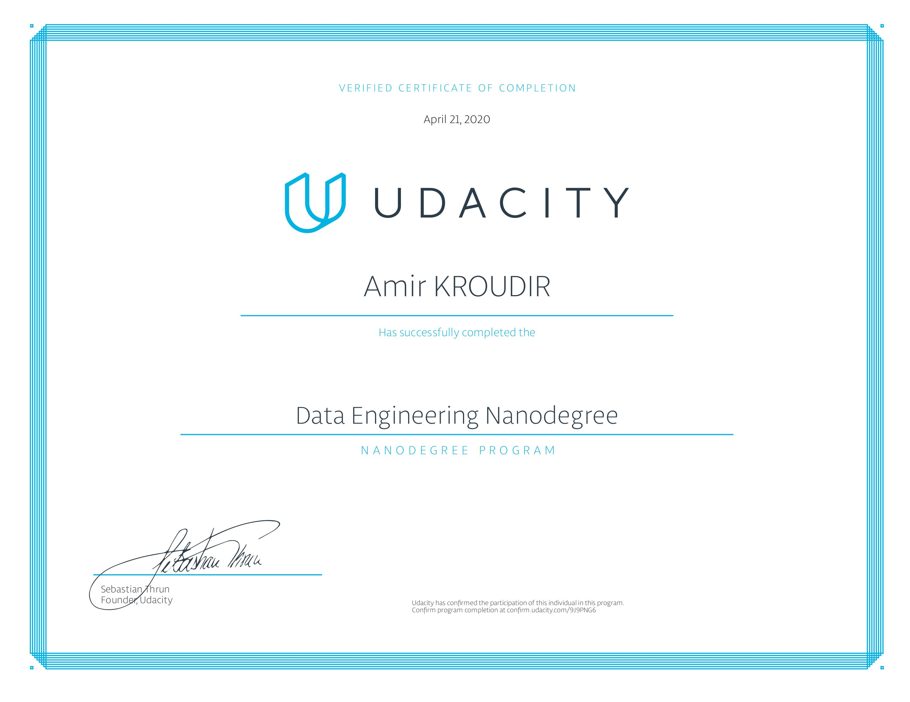

# Data-Engineer-Nanodegree-Projects-Udacity
Projects done in the [Data Engineer Nanodegree by Udacity.com](https://www.udacity.com/course/data-engineer-nanodegree--nd027)

## Course 1: Data Modeling

[Data modeling with Apache Cassandra](1_Data_Modelling/project/data_modelling_project.ipynb)

### Introduction to Data Modeling
- Understand the purpose of data modeling
- Identify the strengths and weaknesses of different types of databases and data storage techniques
- Create a table in Postgres and Apache Cassandra

### Relational Data Models
- Understand when to use a relational database
- Understand the difference between OLAP and OLTP databases
- Create normalized data tables
- Implement denormalized schemas (e.g. STAR, Snowflake)

### NoSQL Data Models
- Understand when to use NoSQL databases and how they differ from relational databases
- Select the appropriate primary key and clustering columns for a given use case
- Create a NoSQL database in Apache Cassandra

#### Project 1: Data Modeling with Postgres and Apache Cassandra

- Apply concepts learned on data modeling with Apache Cassandra and complete an ETL pipeline using Python.
- Model the data by creating tables in Apache Cassandra to run queries.

## Course 2: Cloud Data Warehouses

[Data warehousing with AWS Redshift](2_Cloud_Data_Warehouses/project/README.md)

### Introduction to the Data Warehouses
- Understand Data Warehousing architecture
- Run an ETL process to denormalize a database (3NF to Star)
- Create an OLAP cube from facts and dimensions
- Compare columnar vs. row oriented approaches

### Introduction to the Cloud with AWS
- Understand cloud computing
- Create an AWS account and understand their services
- Set up Amazon S3, IAM, VPC, EC2, RDS PostgreSQL

### Implementing Data Warehouses on AWS
- Identify components of the Redshift architecture
- Run ETL process to extract data from S3 into Redshift
- Set up AWS infrastructure using Infrastructure as Code (IaC)
- Design an optimized table by selecting the appropriate distribution style and sorting key

#### Project 2: Data Infrastructure on the Cloud

- Apply concepts on data warehouses and AWS to build an ETL pipeline for a database hosted on Redshift.
- To complete the project, need to load data from S3 to staging tables on Redshift and execute SQL statements that create the analytics tables from these staging tables.

## Course 3: Data Lakes with Spark
[STEDI Human Balance Analytics](3_Spark_and_Data_Lakes/project/README.md)

### The Power of Spark
- Understand the big data ecosystem
- Understand when to use Spark and when not to use it

### Data Wrangling with Spark
- Manipulate data with SparkSQL and Spark Dataframes
- Use Spark for ETL purposes

### Debugging and Optimization
- Troubleshoot common errors and optimize their code using the Spark WebUI

### Introduction to Data Lakes
- Understand the purpose and evolution of data lakes
- Implement data lakes on Amazon S3, EMR, Athena, and Amazon Glue
- Use Spark to run ELT processes and analytics on data of diverse sources, structures, and vintages
- Understand the components and issues of data lakes

#### Project 3: Big Data with Spark
- Use Spark and AWS Glue allow you to process data from multiple sources, categorize the data, and curate it to be queried in the future for multiple purposes.
- Build a data lakehouse solution for sensor data that trains a machine learning model.

## Course 4: Automate Data Pipelines
[Data Pipelines with Airflow](4_Automate_Data_Pipelines/project/README.md)

### Data Pipelines
- Create data pipelines with Apache Airflow
- Set up task dependencies
- Create data connections using hooks

### Data Quality
- Track data lineage
- Set up data pipeline schedules
- Partition data to optimize pipelines
- Write tests to ensure data quality
- Backfill data

### Production Data Pipelines
- Build reusable and maintainable pipelines
- Build your own Apache Airflow plugins
- Implement subDAGs
- Set up task boundaries
- Monitor data pipelines

#### Project 4: Data Pipelines with Airflow

- Using Airflow to create high grade data pipelines that are dynamic and built from reusable tasks, can be monitored, and allow easy backfills.
- Create custom operators to perform tasks such as staging the data, filling the data warehouse, and running checks on the data as the final step.

